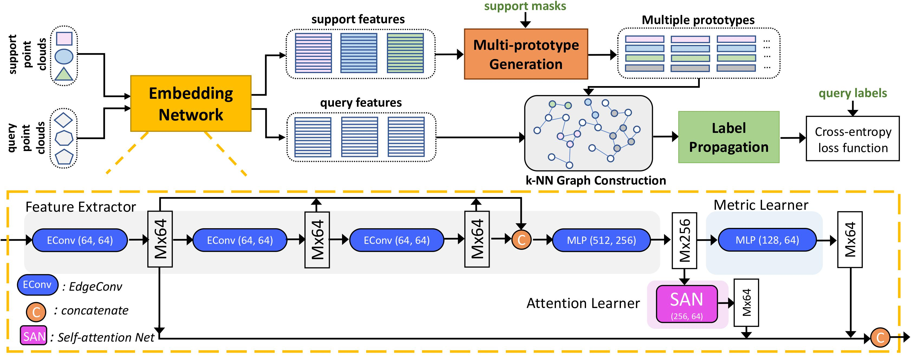

# Few-shot 3D Point Cloud Semantic Segmentation
Created by <a href="https://github.com/Na-Z" target="_blank">Na Zhao</a> from 
<a href="http://www.nus.edu.sg/" target="_blank">National University of Singapore</a>

## Introduction
This repository contains the PyTorch implementation for our CVPR 2021 Paper 
"[Few-shot 3D Point Cloud Semantic Segmentation](https://arxiv.org/pdf/2006.12052.pdf)" by Na Zhao, Tat-Seng Chua, Gim Hee Lee.

Many existing approaches for point cloud semantic segmentation are fully supervised. These fully supervised approaches 
heavily rely on a large amount of labeled training data that is difficult to obtain and can not generalize to unseen 
classes after training. To mitigate these limitations, we propose a novel attention-aware multi-prototype transductive 
few-shot point cloud semantic segmentation method to segment new classes given a few labeled examples. Specifically, 
each class is represented by multiple prototypes to model the complex data distribution of 3D point clouds. 
Subsequently, we employ a transductive label propagation method to exploit the affinities between labeled 
multi-prototypes and unlabeled query points, and among the unlabeled query points. Furthermore, we design an 
attention-aware multi-level feature learning network to learn the discriminative features that capture the semantic 
correlations and geometric dependencies between points. Our proposed method shows significant and consistent 
improvements compared to the baselines in different few-shot point cloud segmentation settings (i.e. 2/3-way 1/5-shot) 
on two benchmark datasets.

## Code
Coming soon.
